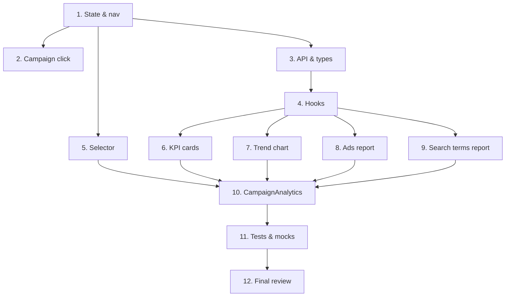

# План реализации: Аналитика и графики по кампаниям

## Обзор

Фича добавляет вкладку «Аналитика кампании» с полным дашбордом: KPI, график динамики, отчёты по объявлениям и поисковым запросам, сравнение периодов и экспорт CSV. Реализация идёт от состояния/навигации к API, затем параллельно собираются UI-компоненты, после чего происходит финальная сборка и тестирование.

## Задачи

### Блок 1 — Состояние и навигация (последовательно)

| # | Задача | Файлы | Зависит от | Режим выполнения | Проверка |
|---|--------|-------|------------|------------------|----------|
| 1 | Добавить `selectedCampaignId` в глобальное состояние и новую вкладку «Аналитика кампании» в навигацию | `src/context/AppContext.tsx` (или `AppProvider.tsx`), `src/lib/navigation.ts`, `src/App.tsx` | — | sequential | `npm run build` / `tsc --noEmit`, приложение открывается и вкладка видна |
| 2 | Привязать клик по кампании в `Campaigns.tsx` к выбору кампании и переключению вкладки | `src/components/Campaigns.tsx` | 1 | sequential | `npm run build`, ручная проверка клика |

### Блок 2 — API и data layer (последовательно)

| # | Задача | Файлы | Зависит от | Режим выполнения | Проверка |
|---|--------|-------|------------|------------------|----------|
| 3 | Добавить типы и Zod-схемы, реализовать функции Reports API для кампании, объявлений и поисковых запросов | `src/types/index.ts`, `src/api/direct.ts` | 1 | sequential | `npm run test` (unit tests для API), `tsc --noEmit` |
| 4 | Реализовать React Query hooks для трёх отчётов | `src/hooks/useCampaignPerformanceReport.ts`, `src/hooks/useAdReport.ts`, `src/hooks/useSearchTermsReport.ts` (или единый файл) | 3 | sequential | `npm run test` |

### Блок 3 — UI-компоненты (параллельно после блока 2)

| # | Задача | Файлы | Зависит от | Режим выполнения | Проверка |
|---|--------|-------|------------|------------------|----------|
| 5 | Селектор кампании | `src/components/campaign-analytics/CampaignSelector.tsx` | 1 | parallel-subagent | `npm run test` + storybook/ручная проверка |
| 6 | KPI-карточки с сравнением периодов | `src/components/campaign-analytics/CampaignKpiCards.tsx` | 4 | parallel-subagent | `npm run test` |
| 7 | График динамики по дням | `src/components/campaign-analytics/CampaignTrendChart.tsx` | 4 | parallel-subagent | `npm run test` + ручная проверка графика |
| 8 | Таблица отчёта по объявлениям | `src/components/campaign-analytics/CampaignAdsReport.tsx` | 4 | parallel-subagent | `npm run test` |
| 9 | Таблица отчёта по поисковым запросам | `src/components/campaign-analytics/CampaignSearchTermsReport.tsx` | 4 | parallel-subagent | `npm run test` |

### Блок 4 — Сборка и QA (последовательно)

| # | Задача | Файлы | Зависит от | Режим выполнения | Проверка |
|---|--------|-------|------------|------------------|----------|
| 10 | Собрать основной компонент `CampaignAnalytics` и подключить все виджеты | `src/components/CampaignAnalytics.tsx` | 5, 6, 7, 8, 9 | sequential | `npm run build` + `npm run test` + ручная проверка |
| 11 | Добавить мок-данные и расширить тесты | `src/test/mocks.tsx`, `src/api/direct.test.ts`, `src/components/CampaignAnalytics.test.tsx` и др. | 10 | sequential | `npm run test` (полный набор) |
| 12 | Финальный ревью, обновление статуса и чеклиста | `docs/features/company-analytics/README.md`, `docs/features/company-analytics/checklist.md` | 11 | sequential | `npm run test` + `npm run build` + сверка со spec.md |

## Стратегия выполнения

1. Последовательно выполнить **Блок 1** (задачи 1–2): без состояния и навигации невозможны остальные шаги.
2. Последовательно выполнить **Блок 2** (задачи 3–4): API и hooks — фундамент для всех виджетов.
3. Параллельно (через субагентов или в одной сессии, если инструменты позволяют) выполнить **Блок 3** (задачи 5–9): селектор и четыре виджета независимы друг от друга.
4. После завершения всех задач блока 3 последовательно собрать **Блок 4** (задачи 10–12): основной компонент, тесты, финализация.

## Граф зависимостей

## Ревью после каждого шага

- После каждой задачи свериться с `spec.md` и `plan.md`: скоуп, критерии приёмки, затронутые файлы.
- Проверить, что изменения не конфликтуют с параллельно выполняемыми задачами (общие файлы, противоречивая логика). Особенно важно для задач 5–9: если они редактируют общий файл (например, `chartTheme.ts` или `csvExport.ts`), синхронизировать договорённости.
- Если задачу выполнял субагент — основной агент проводит ревью результата перед следующим шагом.
- После задачи 10 — проверить полный экран вручную (десктоп + мобильная ширина).
- После задачи 11 — убедиться, что `npm run test` и `npm run build` проходят без ошибок.
- После задачи 12 — обновить статус в `README.md` на `Done` и отметить все пункты чеклиста.
