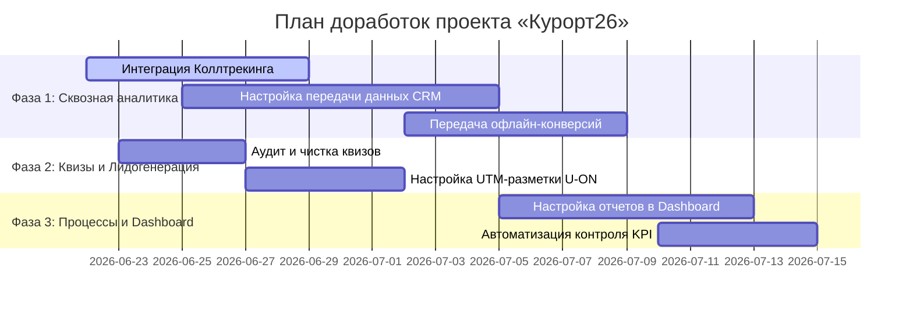

# План доработок рекламного проекта «Курорт26»

На основе анализа регламента ведения и оценки рекламного проекта «Курорт26» был составлен детальный план оптимизации аналитики, лидогенерации и рабочих процессов команды.

---

## 1. Анализ текущего состояния проекта (Аудит)

На текущий момент в проекте зафиксированы следующие ключевые показатели и критические пробелы:

*   **Целевые KPI**: CPL заявки $\le$ 400 ₽, CPL квалифицированного лида $\le$ 600 ₽.
*   **Критические пробелы в аналитике**:
    *   ❌ **Коллтрекинг** отсутствует. Звонки с сайта никак не отслеживаются и не связываются с рекламными кампаниями.
    *   ❌ **Передача данных из CRM** не настроена (статус «Нет» от 01.05.2026). Данные о квалифицированных лидах не возвращаются в рекламные кабинеты/Метрику.
    *   ❌ **Офлайн-конверсии** не передаются (статус «Нет» от 01.06.2026). Оптимизация стратегий Яндекс.Директа по реальным продажам невозможна.
*   **Проблемы с лидогенерацией (Квизы Marquiz)**:
    *   ⚠️ Часть квизов имеет статус «Выяснить» по актуальности.
    *   ⚠️ Источники трафика для некоторых квизов (ВК, SMS, Email) не сегментированы в CRM — используется один и тот же API-ключ U-ON без четкого разделения меток на уровне CRM.
    *   ⚠️ Присутствуют неактуальные квизы от остановленных РК.

---

## 2. Дорожная карта доработок (Roadmap)

### Фаза 1: Настройка сквозной аналитики и отслеживания (Критический приоритет)

| № | Задача | Описание | Ответственный | Срок | Критерий успешности |
|---|--------|----------|---------------|------|---------------------|
| **1.1** | **Внедрение Коллтрекинга** | Выбор провайдера (Mango, CoMagic, Calltouch) и подключение динамического коллтрекинга для веб-трафика + статических номеров для визиток/карт. | Руководитель / Директолог | 7 дней | Звонки фиксируются в Метрике как цели, передаются UTM-метки. |
| **1.2** | **Интеграция CRM с Метрикой** | Настройка передачи статусов сделок из CRM U-ON в Яндекс.Метрику. Настройка Webhooks или использование готового коннектора. | Руководитель / Разработчик | 10 дней | Статусы «Квал. лид» автоматически создают конверсию в Метрике. |
| **1.3** | **Передача офлайн-конверсий** | Настройка выгрузки закрытых сделок (оплат/броней) из CRM в Метрику с задержкой до 21 дня для оптимизации автостратегий Директа. | Руководитель | 7 дней | Данные о реальных оплатах доступны в отчетах Метрики для Директа. |

---

### Фаза 2: Оптимизация лидогенерации (квизы Marquiz)

| № | Задача | Описание | Ответственный | Срок | Критерий успешности |
|---|--------|----------|---------------|------|---------------------|
| **2.1** | **Аудит актуальности квизов** | Проверить квизы №1 (ВК), №2 (СМС), №3 (Email). Определить, крутится ли на них трафик. Неактуальные квизы (в т.ч. №7 «Море - РЕКЛАМА») заархивировать. | Директолог / Аккаунт | 4 дня | Сформирован точный список активных квизов. Отключенные квизы удалены с сайта/кабинетов. |
| **2.2** | **Сегментация лидов в CRM** | Настроить передачу UTM-меток и названия квиза в U-ON CRM при отправке формы. Убедиться, что менеджеры видят, откуда пришел лид (ВК, SMS, Сайт). | Директолог | 5 дней | Каждая сделка в CRM содержит информацию об источнике квиза. |

---

### Фаза 3: Автоматизация контроля и интеграция в Dashboard

Так как проект ведется в рамках десктопного приложения **Yandex Metrics Dashboard**, необходимо интегрировать эти процессы в интерфейс для упрощения контроля.

| № | Задача | Описание | Ответственный | Срок | Критерий успешности |
|---|--------|----------|---------------|------|---------------------|
| **3.1** | **Интеграция расходов Директа и лидов CRM** | Добавить интеграцию API U-ON CRM и API Яндекс.Директ в Dashboard для автоматического расчета CPL заявок и CPL квал. лидов в реальном времени. | Разработчик | 8 дней | На дашборде выводятся актуальные CPL заявок (цель $\le$ 400 ₽) и квал. лидов (цель $\le$ 600 ₽). |
| **3.2** | **Интерфейс контроля чек-листа** | Добавить в Dashboard раздел «Аудит аналитики» с напоминаниями о регулярных проверках (Метрика, квизы, передача данных) раз в 2 месяца. | Разработчик | 5 дней | Приложение присылает уведомления при просрочке даты аудита. |

---

## 3. Матрица ответственности (RACI)

Обновленная структура ролей с учетом доработок аналитики:

*   **R** (Responsible/Исполнитель) — выполняет задачу.
*   **A** (Accountable/Утверждающий) — отвечает за результат, принимает работу.
*   **C** (Consulted/Консультант) — оказывает поддержку, консультирует.
*   **I** (Informed/Информируемый) — уведомляется о результатах.

| Задача | Руководитель | Аккаунт-менеджер | Директолог | Разработчик |
|--------|:---:|:---:|:---:|:---:|
| Настройка коллтрекинга | **A** | **I** | **R** | **C** |
| Интеграция CRM $\rightarrow$ Метрика | **A** | **I** | **C** | **R** |
| Офлайн-конверсии | **R / A** | **I** | **C** | — |
| Чистка и разметка квизов | **I** | **A** | **R** | — |
| Доработки Dashboard приложения | **A** | **I** | **C** | **R** |

---

## 4. Ожидаемый эффект от доработок

1.  **Снижение реального CPL на 15-25%**:
    *   За счет подключения коллтрекинга оптимизация кампаний будет идти по полному объему конверсий (сейчас звонки совершаются вслепую).
    *   Алгоритмы Яндекса (автостратегии) переобучатся на «Квалифицированные лиды» вместо «Всех кликов/заявок», что отсечет нецелевой мусорный трафик.
2.  **Экономия времени команды**:
    *   Автоматический расчет CPL в дашборде избавит аккаунт-менеджера от ручного сведения отчетов из Директа и CRM в Excel.
    *   Прозрачность гипотез и планов в едином интерфейсе приложения.
