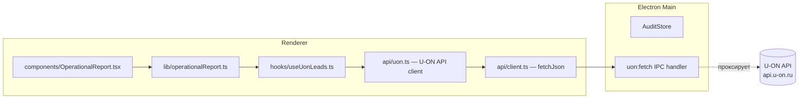

# План интеграции U-ON API

На основе эксперимента (2026-06-21) подтверждена работоспособность API и определена схема интеграции.

---

## 1. Контекст

| Параметр | Значение |
|---|---|
| API-ключ | `IT0ru9zn3VS7tSx044SJ` (из регламента Курорт26) |
| Базовый URL | `https://api.u-on.ru/{KEY}/...` |
| Формат | JSON (`.json` суффикс) |
| Авторизация | Ключ в URL, без заголовков |
| Rate limit | 10 запросов/секунду |
| Пагинация | 100 записей на страницу |
| CORS | ❌ Отсутствует — нужен прокси через Electron main |

### Статусы обращений в CRM Курорт26

| ID | Название | Архивный | Квалифицированный? |
|---|---|---|---|
| 1 | Новый | | ✅ Да |
| 2 | Думает над предложением | | ✅ Да |
| 5 | Временная бронь | | ✅ Да |
| 6 | Лид → Заявка | ✅ | ❌ Нет |
| 7 | Отвалился | ✅ | ❌ Нет |
| 8 | Не выходит на контакт | | ✅ Да |
| 9 | Пустой | ✅ | ❌ Нет |
| 10 | Дубль | ✅ | ❌ Нет |
| 11 | Готовится предложение | | ✅ Да |
| 12 | Распределен менеджеру | | ✅ Да |
| 13 | Ждем цены | | ✅ Да |
| 14 | Постоянный клиент | | ✅ Да |
| 15 | НЕ ВЫШЕЛ НА СВЯЗЬ | ✅ | ❌ Нет |
| 16 | СПАМ / НЕПРАВИЛЬНЫЙ НОМЕР | ✅ | ❌ Нет |
| 17 | ВЕДОМСТВЕННЫЙ / СОЦИАЛЬНАЯ | ✅ | ❌ Нет |
| 18 | ВОПРОС НЕ СВЯЗАН С БРОНИРОВАНИЕМ | ✅ | ❌ Нет |
| 19 | НЕ ОСТАВЛЯЛ ЛИД / НЕ ИСКАЛ САНАТОРИЙ | ✅ | ❌ Нет |
| 20 | Определяется с датами | | ✅ Да |

**Правило квалификации:** лид считается квалифицированным, если его `status_id` не входит в список архивных: `[6, 7, 9, 10, 15, 16, 17, 18, 19]`.

### Ключевые эндпоинты

| Эндпоинт | Метод | Назначение |
|---|---|---|
| `/{KEY}/leads/{date_from}/{date_to}/{page}.json` | GET | Обращения по дате создания с пагинацией |
| `/{KEY}/leads/updated/{date_from}/{date_to}/{page}.json` | GET | Обновлённые обращения (по `dat_updated`) |
| `/{KEY}/lead/search.json` | POST | Поиск по фильтрам (статус, источник, менеджер) |
| `/{KEY}/status_lead.json` | GET | Список статусов |
| `/{KEY}/source.json` | GET | Источники |
| `/{KEY}/lead/{id}.json` | GET | Обращение по ID |

---

## 2. Архитектура интеграции



### Принцип проксирования

U-ON API не отдаёт CORS-заголовки, поэтому запросы из рендерера Electron блокируются браузерным движком. Решение — проксирование через main-процесс, аналогично существующей схеме для Direct API (`direct:fetch` IPC-канал).

---

## 3. Задачи

### 3.1. Electron: проксирование запросов к U-ON API

**Файлы:** `electron/main.ts`, `electron/preload.ts`, `src/types/electron.d.ts`

**Что сделать:**

1. Добавить `api.u-on.ru` в `TRUSTED_EXTERNAL_DOMAINS` в `electron/main.ts`
2. Добавить `api.u-on.ru` в CSP `connect-src` в `electron/main.ts`
3. Создать новый IPC-хендлер `uon:fetch` (аналог `direct:fetch`):
   - Принимает `url` + `options` (method, headers, body, timeout)
   - Проверяет, что URL ведёт на `api.u-on.ru` (trusted)
   - Выполняет `fetch` из main-процесса
   - Возвращает `{ status, body }`
4. Добавить `uonFetch(url, options)` в `preload.ts` → `electronAPI`
5. Добавить `uonFetch` в интерфейс `ElectronAPI` в `src/types/electron.d.ts`

**Критерий:** IPC-канал `uon:fetch` работает, запросы к `api.u-on.ru` проходят из рендерера через прокси.

---

### 3.2. Транспорт: клиент U-ON API

**Файлы:** `src/api/client.ts` (изменение), `src/api/config.ts` (изменение)

**Что сделать:**

1. В `src/api/config.ts` добавить:
   ```ts
   uon: {
     baseUrl: 'https://api.u-on.ru',
   }
   ```
2. В `src/api/client.ts` расширить логику проксирования в `fetchJson`/`fetchText`:
   - Если URL содержит `api.u-on.ru` → направить через `window.electronAPI.uonFetch(...)`
   - Аналогично существующей логике для `api.direct.yandex.com`

**Критерий:** `fetchJson('https://api.u-on.ru/{KEY}/status_lead.json')` из рендерера возвращает данные.

---

### 3.3. API-клиент U-ON

**Файлы:** `src/api/uon.ts` (новый), `src/types/index.ts` (изменение)

**Типы данных (`src/types/index.ts`):**

```ts
export interface UonLead {
  id: number
  id_system: number
  dat: string
  dat_lead: string | null
  dat_close: string | null
  dat_updated: string | null
  status_id: string
  status: string
  source_id: number
  source: string
  manager_id: number
  manager_name: string
  manager_surname: string
  client_id: number
  client_name: string
  client_phone: string
  client_phone_mobile: string
  client_email: string
  utm_source: string | null
  utm_medium: string | null
  utm_campaign: string | null
  utm_content: string | null
  utm_term: string | null
  calc_price: number
  calc_price_netto: number
  calc_increase: number
  calc_decrease: number
  notes: string
  services: unknown[]
  extended_fields: unknown[]
}

export interface UonStatus {
  id: number
  name: string
  ord: number
  is_archive: number
}

export interface UonLeadsResponse {
  leads: UonLead[]
}

export interface UonStatusesResponse {
  records: UonStatus[]
}
```

Zod-схемы для валидации ответов API.

**API-клиент (`src/api/uon.ts`):**

```ts
const UON_PAGE_SIZE = 100
const NON_QUALIFIED_STATUS_IDS = [6, 7, 9, 10, 15, 16, 17, 18, 19]

export async function getUonStatuses(): Promise<UonStatus[]>
export async function getUonLeads(dateFrom, dateTo): Promise<UonLead[]>  // с пагинацией
export async function getQualifiedLeads(dateFrom, dateTo): Promise<UonLead[]>  // фильтр по статусу
export function isQualifiedLead(lead: UonLead): boolean
```

**Логика пагинации:** цикл по страницам (`/leads/{from}/{to}/{page}.json`), пока страница не вернёт < 100 записей.

**Rate limiting:** `PromiseQueue(5)` — не более 5 параллельных запросов (запас от лимита 10/сек).

**Критерий:** `getUonLeads('2026-05-01', '2026-05-31')` возвращает все обращения за май (с пагинацией). `getQualifiedLeads(...)` возвращает только квалифицированные.

---

### 3.4. Хук useUonLeads

**Файлы:** `src/hooks/useUonLeads.ts` (новый)

**Что сделать:**

```ts
export function useUonLeads(projectId: string | undefined, dates: DateRange) {
  // React Query хук
  // queryKey: ['uonLeads', projectId, dates.from, dates.to]
  // Тянет getQualifiedLeads через useAuth (токен не нужен, ключ в конфиге)
  // Возвращает { qualifiedLeads, totalLeads, isLoading, error }
}
```

**Конфигурация:** API-ключ хранится в `OperationalProjectConfig` (новое поле `uonApiKey?: string`), не в auth-контексте. У Курорт26 — `uonApiKey: 'IT0ru9zn3VS7tSx044SJ'`.

**Критерий:** Хук загружает квалифицированные лиды из U-ON по выбранному проекту и периоду.

---

### 3.5. Интеграция в операционный отчёт

**Файлы:** `src/types/index.ts`, `src/config/operationalProjects.ts`, `src/hooks/useOperationalReport.ts`, `src/lib/operationalReport.ts`, `src/lib/operationalMetrics.ts`, `src/components/OperationalReport.tsx`

**Что изменить:**

1. **`OperationalProjectConfig`** — добавить `uonApiKey?: string`
2. **`operationalProjects.ts`** — добавить `uonApiKey: 'IT0ru9zn3VS7tSx044SJ'` для Курорт26
3. **`useOperationalReport.ts`** — добавить параллельный вызов `getQualifiedLeads` (если `project.uonApiKey` задан). Результат — `qualifiedLeadsCount: number` — передаётся в `buildOperationalReportData`
4. **`operationalReport.ts`** — `buildOperationalReportData` принимает опциональный `qualifiedLeadsCount?: number`. Если передан — используется для `cplQualified` вместо `leads` (из Метрики). Если не передан — fallback на `leads` (текущее поведение)
5. **`operationalMetrics.ts`** — `cplQualified = calculateCpl(totalCost, qualifiedLeadsCount ?? leads)` (fallback)
6. **`OperationalReport.tsx`** — без изменений UI (строка «CPL квал. лида» уже есть). Добавить пометку источника данных в subtitle: «CPL квал. лида: CRM» или «CPL квал. лида: Метрика»

**Критерий:** Для Курорт26 CPL квал. лида считается по реальным данным из U-ON CRM. Для проектов без `uonApiKey` — fallback на цель Метрики.

---

### 3.6. Хранение API-ключа U-ON

**Файлы:** `electron/main.ts`, `electron/preload.ts`, `src/types/electron.d.ts`, `src/context/auth.ts`

**Два варианта:**

**Вариант A (рекомендуемый):** ключ в конфиге проекта (`operationalProjects.ts`), как `directClientLogin`. Просто, прозрачно, ключ не секретный (встроен в URL U-ON).

**Вариант B:** ключ в `electron-store` через `safeStorage` (как токен Яндекса). Безопаснее, но усложняет конфигурацию.

**Рекомендация:** Вариант A — ключ U-ON не является секретом в том же смысле, что OAuth-токен Яндекса, и уже встроен в URL API.

---

### 3.7. Тесты

**Файлы:**

| Файл | Что тестирует |
|---|---|
| `src/api/uon.test.ts` (новый) | Парсинг ответов, пагинация, фильтр квалификации, Zod-валидация |
| `src/lib/operationalMetrics.test.ts` (изменение) | `cplQualified` с `qualifiedLeadsCount` и с fallback |
| `src/lib/operationalReport.test.ts` (изменение) | `buildOperationalReportData` с `qualifiedLeadsCount` |
| `src/hooks/useOperationalReport.test.tsx` (изменение) | Mock `getQualifiedLeads` |
| `src/hooks/useUonLeads.test.tsx` (новый) | Хук: загрузка, fallback, error handling |

**Критерий:** Все тесты проходят, `npm run test:unit` — зелёный.

---

## 4. Порядок реализации

```
3.1 Electron IPC (uon:fetch)
 ↓
3.2 Транспорт (client.ts → проксирование)
 ↓
3.3 API-клиент (uon.ts + типы)
 ↓
3.4 Хук useUonLeads
 ↓
3.5 Интеграция в операционный отчёт
 ↓
3.7 Тесты
 ↓
Verify: typecheck + lint + test:unit
```

Задача 3.6 (хранение ключа) решается в рамках 3.5 — поле `uonApiKey` в конфиге.

---

## 5. Риски и ограничения

| Риск | Mitigation |
|---|---|
| Нестабильность API (таймауты 1-3с) | Ретраи (3 попытки), `PromiseQueue(5)` |
| CORS (нужен прокси) | IPC `uon:fetch` через Electron main |
| Большие объёмы (100+ обращений/мес) | Пагинация автоматически |
| Ключ зашит в конфиге | Не секретный, аналогично `directClientLogin` |
| Нет данных за апрель/июнь 2026 | API отдаёт только май 2026 — возможно, данные за другие месяцы очищены |
